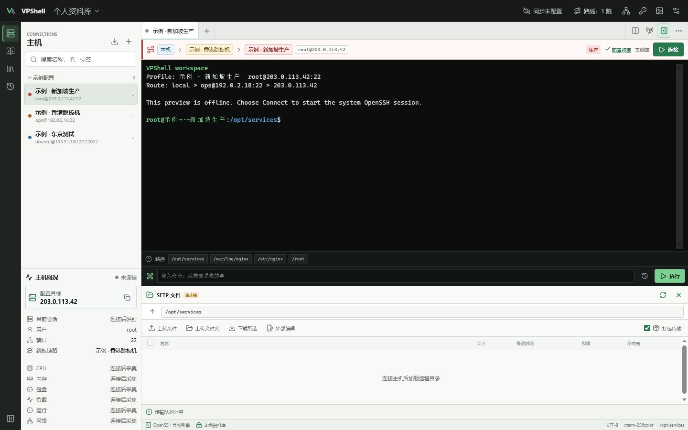

<div align="center">


# VPShell

**面向 VPS 运维的轻量、可审计、同步端自选的 SSH 工作台。**

[](https://github.com/sanrokamlan-prog/VPShell/actions/workflows/ci.yml)
[](https://github.com/sanrokamlan-prog/VPShell/releases)
[](LICENSE)
[](https://tauri.app/)

[下载预览版](https://github.com/sanrokamlan-prog/VPShell/releases/latest) · [Alpha 测试指南](docs/ALPHA_TESTING.md) · [提交反馈](https://github.com/sanrokamlan-prog/VPShell/issues/new/choose) · [架构设计](docs/ARCHITECTURE.md) · [开发标准](docs/DEVELOPMENT.md) · [迁移指南](docs/MIGRATION.md) · [同步协议](docs/SYNC.md) · [安全策略](SECURITY.md)

</div>



> [!IMPORTANT]
> `v0.1.0-alpha.9` 是 Windows-first 技术预览版。本版包含跨重启传输恢复、远程文件操作、Linux 监控、Shell Integration、配置迁移和同步协议核心预览；Android 仅为独立预览工程。当前源码工作区已加入原生跳板、回环限定的本地/远端/SOCKS5 CONNECT 转发、原生 route 滚动评估、自建 Relay 参考服务与部署/轮换基线；桌面 Local Folder 与 HTTPS WebDAV vault 已有显式初始化/解锁、手动单周期和解锁期间的 Rust 自动调度，WebDAV 可选择由 Rust 导入的本机 PEM CA。真实部署、完整端到端同步和 Android 真机验收尚未完成。当前版本不应作为生产密码或私钥管理器。

## 参与 Alpha 测试

请优先在测试 VPS 或已备份的数据上验证，不要首次就在生产主机上使用广播、脚本或批量传输。测试前阅读 [Alpha 测试指南](docs/ALPHA_TESTING.md)，其中列出了安装、SSH、SFTP、打包传输、外部编辑、迁移、密钥、网络诊断和持久化的逐项测试步骤。

测试结果和普通缺陷请使用 [结构化 Issue 表单](https://github.com/sanrokamlan-prog/VPShell/issues/new/choose)。提交前必须删除真实密码、私钥、Token、生产 IP、主机名和敏感终端输出；安全漏洞请使用 [GitHub 私密漏洞报告](https://github.com/sanrokamlan-prog/VPShell/security/advisories/new)，不要创建公开 Issue。

## 为什么做 VPShell

现有 SSH 工具往往把体验做在厂商云、封闭加速服务或单一平台之上。VPShell 希望保留好用的工作流，同时把数据和基础设施控制权交还给用户。

## 定位与可持续性

VPShell 是 **Apache-2.0 开源、local-first 的 VPS/SSH 运维工作台**。连接资料、密钥引用、终端、SFTP 和用户自建的同步基础设施始终由用户控制；

若长期运营需要商业收入，收费边界只会放在可选的托管基础设施与服务上，例如托管中继、团队协作与审计、企业支持或托管加密同步。基础 SSH、SFTP、密钥管理、本地资料库以及用户自建同步不会因托管服务出现而被撤回或锁进付费版。

| 运维痛点 | VPShell 方向 | `v0.1.0-alpha.7` |
| --- | --- | :---: |
| 多设备配置被厂商云锁定 | Local Folder、WebDAV、SFTP、S3、自建 Gateway，上传前端到端加密 | **部分接线**：密码学、恢复/导出、设备 registry、Local/WebDAV provider、持久 outbox/replay、确定性 merge 与 Rust 协调器内核已实现；桌面 Local Folder 与 WebDAV 可显式初始化/解锁并运行手动或自动单周期，WebDAV 密码只保存到系统凭据管理器；主机公开字段、安全自建脚本、五个固定设置实体、公开命令/路径/非敏感参数历史及桌面冲突中心已接入双向事务交接，Android 只读状态已接通但运行能力保持禁用；连接历史、背景图片资产、扩展 provider 与真实多设备矩阵仍未完成 |
| 大量小文件/目录传输缓慢 | 自动探测 `tar + zstd`，缺少远端能力时回退 SFTP | **已实现**：直连后端 |
| 命令、路径和参数反复复制 | 不设产品条数上限的事件历史、快速检索和参数模板 | **部分实现**：公开命令、每主机最近路径和模板非敏感参数历史已具备加密同步与删除；最近连接仍只在本机 |
| 操作时忘记当前主机 | 常驻配置 IP、环境标记、Shell Integration 上报 hostname/cwd | **v0.2 工作区**：显式 bash/zsh 探针与 8 层自报上下文栈 |
| 多机操作效率低且容易误发 | Compose 广播、目标清单、生产/危险命令保护 | **v0.2 工作区**：Rust 冻结预览、生产确认与危险广播拦截 |
| 常用运维脚本四处散落 | 有来源、版本、风险和参数的可同步脚本中心 | **部分实现**：本地脚本中心 |
| 不知道该运行什么排障命令 | 中文意图匹配、参数表单、风险分级和执行前预览 | **已实现**：22 项本地命令/工具 |
| 本机与 VPS 线路难量化 | 路由追踪、限量 HTTP 下载、双向 UDP 吞吐/抖动/丢包 | **已实现**：本机网络诊断 |
| 海外 SSH 高延迟 | 跳板/代理/自建中继测速选路，可选 Mosh | **部分实现**：原生终端支持已固定逐跳身份的应用内跳板和自建 Relay；路线评估可比较直连与已配置跳板的完整 SSH/SFTP readiness；桌面直连可显式选择系统 Mosh，但没有真实区域指标、自动切换或加速承诺 |
| 终端外观受限 | 本机或 URL 背景、可见度调节并随资料库同步 | **已实现**：本机/URL 背景 |

## 当前可用能力

- Tauri 2 + 系统 WebView，安装包不捆绑完整 Chromium。
- xterm.js 多标签终端，支持输入输出、窗口缩放、断开和 250,000 行 scrollback。
- Rust 后端通过跨平台 PTY 启动系统 `ssh`，支持自定义端口、私钥路径、keepalive，以及从系统钥匙串为直连会话提供密码或私钥口令。
- 真实 SFTP 目录、递归文件/目录上传下载、资源管理器拖放、字节进度、临时文件校验和原子提交；后端登记最多 6 个并行任务，可查询、取消和移除已结束任务。
- 大量小文件可使用客户端生成的 `tar + zstd` 包传输；远端缺少 `tar`/`zstd` 时回退递归 SFTP，打包或传输过程失败时明确报错。
- 左侧主机概况常驻显示配置 IP、用户并可复制 IP；直连凭据可用时由 Rust 监控会话读取 Linux `/proc` 的 CPU、内存、磁盘、负载、流量和进程摘要，提供 5/15/30/60/120 秒频率、暂停/恢复，以及最近 120 点的资源趋势。断线或切换活动会话会停止旧采样，Windows 不再弹出外部 SSH 窗口；独立连接失败不会被直接归类为导入密码错误。
- 远端普通文件可用 Notepad++、VS Code/VSCodium、用户指定程序或系统编辑器打开；Rust 使用固定适配参数启动程序，检测本地保存并在回传前比较远端哈希。编辑会话以无凭据的有界原子索引跨重启恢复，集中显示冲突并提供另存本地、重新下载、明确强制覆盖或丢弃。
- 主机分组、生产/基础设施/测试环境标记，以及常驻直连身份栏。
- 最近发起的连接按时间置顶，并保留最后路径、用户和连接时间；这些主机、历史、脚本、设置和背景元数据现由 Rust SQLite 事务快照管理，首次启动会有界迁移旧 WebView 状态，失败时保留旧键并显示诊断。
- FinalShell 主机、端口、用户名和可选密码导入；重复导入会更新已有主机的凭据引用，密码只进入系统钥匙串，不返回前端，并可用于直连终端、采样与 SFTP。
- v0.2 工作树提供 OpenSSH、PuTTY、Xshell、SecureCRT、MobaXterm、Tabby 和 Termius 的显式来源迁移预览；Rust 只读扫描并逐字段报告映射、跳过和失败，密码、Token、私钥内容及其他应用 vault 不进入 IPC。
- 连接前通过无凭据的系统 OpenSSH 握手和 `ssh-keygen` 检查 `known_hosts`，并只启用当前 `ssh` 二进制实际报告支持的安全 KEX；未知主机显示算法和 SHA256 指纹供明确确认，确认时只进行一次远端复核并在本地验证写入，已变化指纹硬拒绝，终端、SFTP 与采样共享信任结果。
- Ed25519/RSA4096 密钥生成、OpenSSH 口令加密，以及把所选公钥安装到当前已连接主机。
- 桌面原生 `russh` route 可显式启动固定 `127.0.0.1` 的本地、远端和 SOCKS5 动态转发；动态转发只实现无认证 CONNECT，拒绝 BIND、UDP ASSOCIATE、未知地址类型和无效目标，最多 8 条且每条最多 32 个连接。源码已通过 Actions 的真实双 sshd fixture，真实多服务器兼容仍需外部验收，系统 OpenSSH 继续是默认引擎。
- 桌面直连标签可显式选择 Mosh 独立交互模式。Rust 以固定参数启动本机 `mosh`，SSH bootstrap 继续强制本机 `known_hosts`、安全 KEX 和受限 AskPass，远端 helper 固定为 `mosh-server`，UDP 固定为 60000–61000。它不支持 VPShell 跳板 route，不复用 SFTP 或转发；本机/远端安装、UDP firewall、漫游和长时间断网恢复需用户在自有节点验收。
- 多终端 Compose 命令栏、命令历史检索和路径快捷输入。
- 连接后可显式启用 bash/zsh Shell Integration；带随机会话令牌的有界控制帧上报 hostname/user/cwd，Rust 维护最多 8 层嵌套上下文，退出嵌套 shell 后回退到已知祖先。它是远端自报状态，不替代主机密钥验证。
- Compose 安全广播由 Rust 冻结命令、目标会话和 Shell 上下文代际，两分钟单次预览后才发送；生产目标持续标记，认证交互与已知破坏性命令禁止广播，目标变化逐项跳过并分别报告成功/失败/跳过。Raw input 广播仍未实现。
- 本机 PNG/JPEG/WebP 壁纸、TTF/OTF/WOFF 字体由 Rust 按魔数、大小和符号链接边界读取并原子缓存；HTTPS 壁纸禁止凭据/query/fragment、禁止重定向，WebView 只接收受管 data URL，业务状态不再写入 localStorage/IndexedDB。
- 22 项命令/工具的本地中文意图搜索、参数填写、最近非敏感参数值预填、风险提示和执行前预览；显式敏感字段和敏感名称永不进入参数历史。
- 脚本来源、风险提示、复制/加入命令栏和用户自建配方。
- 本机路由追踪、指定 URL 限量下载测速，以及本机与自建 VPS 之间的 iperf3 UDP 双向测速。
- 本机 PNG/JPEG/WebP 或 URL 终端背景。
- 首次启动自动显示分步使用指南，逐项标明添加、导入、连接、SFTP、广播、密钥、设置和升级按钮；右上角问号可随时重新打开。
- 删除的主机、历史和路径进入 30 天回收站，可恢复或永久删除；关联系统凭据仅在永久删除或到期且未被其他主机引用时清理。

当前连接和传输只支持直连；取消会在安全检查点停止工作并清理已知临时路径，最终提交阶段可能已经来不及取消。`v0.1.0-alpha.7` 发布产物仍不支持暂停、断点续传、应用重启后的持久任务恢复或文件坞变更操作；当前 v0.2 工作区已实现跨重启恢复、带 Rust 预览令牌和二次确认的文件坞操作，以及 Rust 管理的有界 Linux 监控历史与暂停/频率控制，等待下一版发布。远端监控仍仅支持 Linux，采样历史只保留在当前应用进程中。Local Folder 同步在桌面显式解锁后由 Rust 统一处理启动/业务变更防抖、周期和失败复查，也保留手动单周期；当前接通主机公开字段、安全自建脚本、终端字体族/字号/行高、背景可见度、自动上传编辑文件/包传输两个行为偏好及通过秘密扫描的命令/路径/非敏感参数历史。编辑器路径、自定义字体资产/名称、连接历史和背景图片资产尚未接线，调度也不是应用关闭后的系统后台服务。完整边界见 [架构文档](docs/ARCHITECTURE.md#2-v010-已实现)。

## 下载与安装

正式预览产物只从 [GitHub Releases](https://github.com/sanrokamlan-prog/VPShell/releases) 发布：

| 平台 | GitHub Actions 产物 | 当前支持级别 |
| --- | --- | --- |
| Windows 10/11 x64 | NSIS `setup.exe`、MSI | Windows-first，首要验收平台 |
| Linux x64 | AppImage、DEB | 技术预览，需继续覆盖发行版兼容性 |
| macOS Apple Silicon / Intel | DMG | 技术预览，当前为 ad-hoc 签名、未公证 |

推送 `v*` 标签后，[Release workflow](.github/workflows/release.yml) 会分别在 Windows、Ubuntu 和 macOS 原生 GitHub-hosted runner 上构建，先写入不可见草稿，确认安装包和四个平台 updater 条目完整后再公开。Alpha/RC 由 SemVer 后缀标识；GitHub Release 元数据保持 full release，原因是 GitHub 的 `/releases/latest` 会排除 prerelease，而客户端自动更新使用该固定地址。这不代表 Alpha 已达到稳定版质量。项目不声称能在一台 Windows 机器上可靠产出所有平台的正式安装包；本地构建只用于开发和目标平台验证。

每个 Release 同时提供 `SHA256SUMS`、Tauri updater 签名和 `THIRD_PARTY_NOTICES.md`；Release Notes 从同版本 [CHANGELOG](CHANGELOG.md) 自动生成。SHA-256 与 updater 签名用于验证下载内容，不能替代 Windows/macOS 的发行者身份签名。

当前 Windows 安装包尚无 Authenticode 代码签名，macOS 包也尚无 Apple Developer ID 公证，系统可能显示未知发布者或安全提醒。Tauri updater 的产物签名用于校验更新文件完整性，不能替代操作系统发行者签名。稳定版发布前必须补齐相应签名、公证和实机验收。

VPShell 当前调用系统 `ssh`。安装后先验证：

```powershell
ssh -V
```

Windows 如找不到该命令，请在可选功能中安装 **OpenSSH Client**；macOS/Linux 请使用系统包管理器安装 OpenSSH 客户端。首次连接由 VPShell 显示算法和 SHA256 指纹并等待用户明确确认；已保存指纹发生变化时会硬阻止连接，不能一键覆盖。

## 使用

首次启动会自动打开 5 步“VPShell 使用指南”，每一步直接列出图标、按钮名称和用途；之后可点击右上角问号按钮重新查看。

1. 点击主机区域的 `+`，填写 IP/域名、端口、用户名和可选私钥路径，或从 FinalShell 导入。
2. 打开主机标签，核对顶部常驻的别名、用户、IP 和环境。
3. 点击“连接”；首次指纹需在 VPShell 对话框中人工确认，已导入的直连密码会从系统凭据管理器自动使用。
4. 需要复用命令时使用底部命令栏；广播前逐个勾选目标。
5. 也可以在命令栏输入“磁盘满了”“查看 nginx 日志”或“UDP 测速”，选择本地匹配结果并先核对最终命令。
6. 脚本中心只会显示来源并把最终命令加入命令栏，不会后台静默执行。
7. 打开底部文件坞浏览真实 SFTP 目录；双击普通文件可启动外部编辑，发生远端冲突时必须选择重新下载或确认强制覆盖。
8. 删除主机后可在左侧“回收站”恢复；记录保留 30 天，只有“永久删除”或到期清理才会移除未被其他主机使用的系统凭据。

首次启动不附带任何示例主机。添加自己的主机或完成 FinalShell 导入后即可使用真实 SSH 会话。

## 从其他 SSH 工具迁移

`v0.1.0-alpha.7` 支持从 FinalShell 配置目录导入主机、端口、用户名和可选密码。密码在 Rust 后端解码后直接写入 Windows Credential Manager（或对应平台系统钥匙串），明文不会进入 WebView；直连终端、采样和 SFTP 通过随机凭据引用使用它。导入器只报告密码是否成功解密并写入系统凭据库，不会把某次独立 SSH/SFTP 连接失败误称为“导入密码错误”。旧代理引用只保留标记，当前版本不会恢复代理或跳板路线。

从 `alpha.2` 升级后，请重新选择同一个 FinalShell 配置目录导入一次。VPShell 会合并重复主机并更新系统凭据引用，不需要逐台输入密码；源配置仍保持只读。

v0.2 未提交工作树另提供 OpenSSH、PuTTY `.reg`、Xshell `.xsh`、SecureCRT 会话 `.ini`、MobaXterm bookmark、Tabby YAML/JSON 和 Termius JSON 的专用只读适配器。除 FinalShell 的独立可选密码流程外，这些来源只迁移非敏感连接字段；先生成五分钟、单次有效的 Rust 冻结预览，逐项核对后才能加入资料库。无法无损展开的 OpenSSH `Include`/`Match`/通配 Host、known_hosts 信任、代理、密码、Token、私钥路径/内容均明确跳过。格式和平台变体边界见 [MIGRATION.md](docs/MIGRATION.md)。跨客户端导出仍未实现，VPShell 不会把凭据导出成 FinalShell 的旧 DES 格式。

## 脚本中心

首批目录根据项目 README 核对入口，不复制第三方脚本正文：

| 配方 | 来源 | 默认风险 |
| --- | --- | --- |
| SafeVPS 安全加固 | [sanrokamlan-prog/safevps](https://github.com/sanrokamlan-prog/safevps) | 高 |
| Nginx Easy Deploy | [sanrokamlan-prog/nginx-easy-deploy](https://github.com/sanrokamlan-prog/nginx-easy-deploy) | 高 |
| VPS Health Check | [sanrokamlan-prog/vps-health-check](https://github.com/sanrokamlan-prog/vps-health-check) | 低 |
| 流媒体、IP 风险、节点质量检查 | 各上游公开来源 | 中 |
| BBR 调优 | [chnnic/BBR-tune](https://github.com/chnnic/BBR-tune) | 高 |
| DD 重装系统 | 用户配置具体配方 | 破坏性 |

远程 `curl | bash`/`wget | bash` 会显示最终命令和来源。明文 HTTP、系统调优、防火墙和磁盘操作必须保持高风险标记；未来版本会增加固定 commit/hash、参数 schema 和逐主机确认。

## 网络诊断

路由追踪和测速由本机 Rust 后端执行，不会隐式广播到 SSH 会话。路由追踪在 Windows 调用 `tracert`，在 macOS/Linux 调用 `traceroute`；HTTP 下载测速必须填写目标 URL，并受超时与最大下载量限制。

本机与自建 VPS 之间的 UDP 测速使用系统 `iperf3`。先在测速 VPS 显式运行：

```bash
iperf3 -s -p 5201
```

再在 VPShell 选择正向“本机 → VPS”或反向“VPS → 本机”，填写目标带宽、时长和端口。VPShell 不会自动安装 `iperf3`、启动服务端或修改防火墙；执行前会显示按设定带宽估算的最大流量。

## 同步与二次验证

同步目标设计为不可信对象存储。完整方案不会上传 SQLite 整库，而是把本地 operation 分段、压缩、加密后上传；二级同步密码通过 Argon2id 包裹随机 Vault Master Key，数据对象使用 XChaCha20-Poly1305。

Google Authenticator/TOTP 只用于未来自建 Gateway 的账户登录，不能替代二级同步密码或恢复密钥。Local Folder、WebDAV、SFTP 和 S3 不虚构一层本地 TOTP。完整边界见 [SYNC.md](docs/SYNC.md)。

## “智能加速”的边界

调整 SSH keepalive、压缩或复用连接并不等于海外线路加速。真正的跨境选路需要中继节点、持续测速和可解释的路线选择。

VPShell 当前源码实现 `Direct`、用户显式配置的原生逐跳 route、两端均限制回环的本地/远端端口转发，以及固定本机回环监听的 SOCKS5 CONNECT 动态转发。后续路线是：

```text
Direct -> ProxyJump -> SOCKS5 -> HTTP CONNECT -> 用户自建 Relay -> 可选托管节点
```

`vpshell-relay` 现在提供可运行的自建参考服务与本机回环 client：服务端用随机挑战/HMAC-SHA256 认证、精确目标 allowlist、连接/字节/时长限额和无敏感值 JSONL 审计，只转发最终 SSH 密文字节，不终止 SSH 或读取凭据。服务端支持最多 4 个 token 的有界重叠轮换，仓库提供 hardened systemd/logrotate 基线以及协议升级、撤销、回退和故障恢复演练；协议控制面仍不加密，真实 TLS/VPN、firewall、日志轮换执行和多区域部署由运维者外部验收。没有真实部署和公开实测指标前，项目不会把它宣传成“海外智能加速”。部署和限制见 [docs/RELAY.md](docs/RELAY.md)。

网络诊断的“路线评估”由 Rust 在用户显式启动后执行。它最多比较 4 个原生 route；当前界面为同一目标生成直连和已配置跳板两种候选，每轮都完成逐跳认证、host-key pin 和最终 SFTP readiness。单个 campaign 限 30–300 秒间隔、3–20 轮滚动窗口和最多 120 轮；评分由成功率、中位数、P95 与失败惩罚组成，80% 成功率以下不推荐，15% 切换滞后避免小幅波动反复改变建议。快照只返回候选 ID、统计量和稳定错误码，关闭对话框即取消。它不自动修改 route，也不代表 UDP 丢包、吞吐、地域质量或“加速”效果。

Mosh 是终端顶部的独立桌面直连模式，不是路线评估结果或自动回退。使用前需自行安装本机 `mosh` 和远端 `mosh-server`，并在自有服务器 firewall 放行 UDP 60000–61000；VPShell 不安装软件或修改 firewall。首次连接仍先经过结构化 SSH host-key 检查，Mosh 的 SSH bootstrap 随后强制严格主机密钥策略。文件坞、上传下载、外部编辑和端口转发继续使用各自 SSH/SFTP 路径。

## 本地开发

环境要求：Node.js 22+、Rust stable，以及 [Tauri 2 对应平台依赖](https://v2.tauri.app/start/prerequisites/)。Windows 需要 Microsoft C++ Build Tools 的 **Desktop development with C++** 工作负载。

```bash
npm install
npm run build
npm run tauri dev
```

普通 Windows PowerShell 没有加载 MSVC 环境时，可使用仓库脚本：

```powershell
powershell -ExecutionPolicy Bypass -File scripts/windows-dev.ps1 check
powershell -ExecutionPolicy Bypass -File scripts/windows-dev.ps1 test
powershell -ExecutionPolicy Bypass -File scripts/windows-dev.ps1 dev
powershell -ExecutionPolicy Bypass -File scripts/windows-dev.ps1 build
```

验证：

```bash
npm run build
cargo check --manifest-path src-tauri/Cargo.toml
```

## 项目结构

```text
src/                    React 工作台与 xterm.js
src-tauri/src/          PTY、OpenSSH 会话和 Tauri IPC
src-tauri/icons/        可编辑 SVG 与平台图标
docs/ARCHITECTURE.md    SSH、终端、传输、历史、脚本和中继设计
docs/DEVELOPMENT.md     模块边界、IPC、安全、测试与发布准入标准
docs/MIGRATION.md       FinalShell 导入与其他客户端迁移边界
docs/OPEN_SOURCE_REFERENCES.md  开源参考、许可证边界与已采纳设计
docs/RELAY.md           自建 Relay 协议、运行边界、限流与审计
docs/SYNC.md            加密同步、冲突、恢复和 TOTP 边界
scripts/                本地开发辅助脚本
```

## 开源项目实现审计

VPShell 会持续审计成熟公开项目的模块边界和用户工作流，但不会未经许可复制第三方实现。当前已纳入设计决策的公开参考包括：

- [Tabby](https://github.com/Eugeny/tabby)：配置、逻辑密钥标识、插件与终端会话分层；
- [Electerm](https://github.com/electerm/electerm)：终端、SFTP、快捷命令和多后端同步保持独立能力边界；
- [WindTerm](https://github.com/kingToolbox/WindTerm)：认证完成后再按顺序启动 Shell、SFTP 和系统监控，减少并发失败与重复提示；
- [Termora](https://github.com/TermoraDev/termora)：有界并发传输、远端互传、权限编辑和分层主机工作流；其 AGPL-3.0 实现只作行为参考；
- [openFinalShell](https://github.com/kexue-aihao/openfinalshell)：仅用于核对 FinalShell 数据迁移和桌面工作流，不把兼容代码作为安全事实来源。
- [Mosh](https://github.com/mobile-shell/mosh)：只参考独立交互模式和公开命令边界，并调用用户另行安装的程序；GPL-3.0 源码未复制、链接或打包。

所有吸收项都要重新按 VPShell 的 Rust/Tauri 安全边界实现，并经过本项目测试与许可证检查。逐项目的许可证边界、代码复用状态和已采纳设计见 [OPEN_SOURCE_REFERENCES.md](docs/OPEN_SOURCE_REFERENCES.md)；实际使用或改编的第三方代码只记录在 [THIRD_PARTY_NOTICES.md](THIRD_PARTY_NOTICES.md)。

## 路线图

路线图描述未来方向，不是发布日期或功能承诺。只有进入安装包、通过对应平台验收并写入 Release Notes 的能力，才会移动到“当前可用能力”。

| 里程碑 | 主题 | 当前状态 |
| --- | --- | --- |
| Alpha | 真实 SSH/SFTP 工作流与可安装预览版 | 首个技术预览 |
| v0.2 | 传输可靠性、上下文识别与安全批量运维 | 进行中：跨重启恢复、文件坞移动/递归权限与安全批量任务已实现，等待发布与平台验收 |
| v0.3 | 用户自控的端到端加密同步 | 内部协议原语分批实现中，尚不是可用产品功能 |
| Android Preview | 移动终端、SFTP、凭据与同步 | Android 壳及 Rust/libssh2 连接、终端、只读 SFTP、Keystore 凭据和可选系统验证访问门已接线；只读显示 Rust 同步协调器状态但 Sync capability 仍禁用，设备验收待完成 |
| 后续 | 原生 SSH 引擎、可验证中继和可选托管服务 | 研究方向 |

### Alpha 当前阶段

已经打通系统 OpenSSH 真实终端、FinalShell 导入、SSH 密钥、命令/脚本库、多会话 Compose 广播、本机网络诊断、真实 SFTP、打包传输、可查询和取消的传输任务、Linux 负载区、最近连接和安全外部编辑。**VPShell** 名称与 **A - Terminal V** 图标已经定稿并生成平台图标。

Alpha 发布后的重点验证：

- 扩大临时及真实 OpenSSH/SFTP 主机覆盖，继续验证上传、下载、目录、中文路径、远端冲突和失败清理；
- 扩大 Windows 安装包冷启动、签名更新链路、OpenSSH 缺失，以及 Notepad++ 已安装/未安装场景覆盖；
- 扩大 Linux 发行版和 macOS Intel/Apple Silicon 实机兼容性反馈，未通过的平台问题按 Alpha 缺陷处理。
- 已开始实现结构化主机指纹确认：终端、SFTP 和监控共享同一 `known_hosts` 信任结果，未知指纹显式确认，已变化指纹不可覆盖。

### v0.2 - 文件、监控与编辑器

- 在现有后端任务注册表、运行时恢复和安全取消基础上，增加跨应用重启的版本化恢复记录、明确的重试/丢弃决策、应用级最多 3 次重试和失败诊断；字节级断点续传仍未实现；
- 恢复记录只保留重试所需的方向、主机身份和路径元数据，不保存密码、私钥、credential ref、私钥路径、原始连接秘密或文件内容；已跨过提交边界的任务只能核对后丢弃，不能重放；
- 文件坞已实现 Rust-owned 新建目录、同目录无覆盖重命名、跨目录/跨文件系统移动、递归权限、显式批量删除和逐项结果；移动提供 `fail`、冻结新名称的 `rename` 与明确 `overwrite`，复制经目标目录暂存、大小/SHA-256 核验、原子提交后才清理源；
- 危险操作使用短时单次预览令牌与二次确认，目录/选择变化不能沿用旧确认；批量文件任务可取消并进入同一持久恢复中心，重启后必须重新预览，已越过提交边界的记录不会重放；
- 文件坞键盘工作流已覆盖范围选择、全选、方向/Home/End 焦点移动、Enter 打开、F5 刷新、F2 重命名、Delete 删除、Alt+Up 返回、Ctrl/Cmd+L 定位路径和 Ctrl/Cmd+Shift+M 移动；
- Linux 实时概况已由 Rust 管理采样生命周期，显示最近 120 点的 CPU、内存、磁盘、负载和网络趋势，支持 5 至 300 秒后端频率范围、界面常用频率与暂停/恢复；断线、切换和代际替换会阻止旧结果落账；
- Notepad++、VS Code/VSCodium 和用户自定义编辑器已使用 Rust 固定参数适配；最多 16 个编辑会话以 128 KiB、14 天保留的无凭据原子索引跨重启恢复，远端冲突集中提供另存、重新下载、强制覆盖或丢弃决策；
- 显式 bash/zsh Shell Integration 已使用随机令牌和有界 OSC 帧维护最多 8 层嵌套自报上下文；Compose 安全广播已提供 Rust 冻结目标、单次预览、生产确认、认证/危险命令拦截和逐目标结果；fish/PowerShell Integration、退出码跟踪与 Raw input 广播仍待后续；
- OpenSSH、PuTTY、Xshell、SecureCRT、MobaXterm、Tabby 和 Termius 已提供可审计的非敏感配置预览/导入；真实客户端版本差异仍按迁移矩阵进行平台验收；
- SQLite schema v1 事件库、严格 CSP、仅 main window 的细粒度 Tauri capability、资产边界和持续安全回归测试已在 v0.2 工作树实现；同步 outbox 仍属于 v0.3。

### v0.3 - 用户自控的加密同步

- Rust 密码学基础层已实现版本化 keyslot/对象信封、Argon2id、XChaCha20-Poly1305、HKDF 域分离、严格有界解析和固定向量测试；
- Rust `list/get/put` provider 边界与 Local Folder/WebDAV 不可变对象实现已经具备有界 I/O、无覆盖提交、超时、取消和协议测试；
- schema v1 SQLite 同步 journal 已实现 operation/outbox 原子事务、租约恢复、暂停、最多六次有界退避、发布终态、AEAD 后幂等应用和设备序号/对象身份重放保护；桌面 Local Folder 使用不可变 bootstrap 显式初始化或解锁 Argon2id keyslot，并可由 Rust 调度器或手动调用协调器的有界单周期 push/pull 与 merge；
- 主机、公开命令/参数/远端路径历史、脚本、白名单设置和受管背景引用已有 Rust 确定性字段合并、tombstone 因果与持久冲突中心；敏感历史、凭据引用、主机 trust pin 和本机路径拒绝进入 operation；
- 独立 256-bit 恢复密钥使用带校验码的可打印格式和独立 HKDF/XChaCha recovery keyslot；加密导出包只包含 keyslot、认证密文和校验清单，最多 10,000 对象/256 MiB 密文，以无覆盖原子文件写入，并可离线解密、解析全部 event/device registry 完成恢复演练；
- 设备 registry 最多 32 台，只记录公开签名键和非敏感标签；撤销单调、最后活动设备不可撤销、已撤销设备不能发布 registry。撤销不能抹除已复制的 VMK，疑似泄露时仍必须轮换主密钥并全量重加密；设备 operation 签名、registry 验证和管理 UI 尚未接线；
- 独立凭据 vault 策略默认关闭，需活动设备显式启用并逐设备授权；CVK 与业务 VMK 分离，使用 `credentials` keyslot/AAD/HKDF 域。SSH 密码、私钥口令、OpenSSH 私钥和 access token 只进入 Rust 内存中的清零载荷与认证密文，本机 credential reference 不进入对象、错误、日志或事件；系统钥匙串写回、CVK 恢复/轮换和 UI 尚未接线；
- SFTP、S3-compatible 与自建 Gateway 已通过专用 Rust transport trait 接入同一不可变 provider：严格配置、分页/key/大小、取消、条件创建、同名核对和提交后回读由公共适配层强制。SFTP 配置必须固定 host-key SHA-256，S3/Gateway endpoint 必须 HTTPS；Gateway 密码/TOTP 只传入一次登录调用，provider 会话不保存 TOTP。真实 SFTP 会话、S3 SigV4、Gateway HTTP 客户端与外部兼容矩阵仍未接线；
- AppState 主机公开字段、安全自建脚本、五个固定设置实体和通过秘密扫描的命令/路径/非敏感参数历史已接入 operation/outbox 事务入队与合并结果回写；三类历史使用稳定实体 ID 与 tombstone，清空会同步删除，含明显密码/Token/私钥/credential reference 的记录、敏感或未知参数及没有真实时间的旧路径只留本机。背景可见度只同步 5%–65% 的数值，图片来源与资产仍保持本机；桌面解锁期间的启动/变更防抖/周期/失败复查调度及持久冲突解决 UI 已接线；WebDAV HTTPS/basic-auth 产品入口复用同一协调器，provider 密码使用本机随机引用存入系统凭据管理器，自签 PEM CA 由 Rust 复制到应用私有目录并以本机随机引用加载，两者都不进入同步包；编辑器路径、自定义字体资产/名称、连接历史、背景图片资产、扩展 provider 和真实多设备矩阵仍待实现；
- TOTP 只保护 Gateway 登录，不替代二级同步密码、恢复密钥或 E2EE 数据密钥。

### Android Preview - 移动端

- v0.3 工作树包含 Tauri Android 壳与共享 Rust `android_preview` 契约：首版能力逐项声明，严格限制为最多 8 个前台会话，并在后台、锁定和断开时阻止或清空原生会话。Android 使用单独 capability，不能调用桌面的系统 OpenSSH、广播、外部编辑、监控、updater 或 process 命令。
- 复用 React/xterm.js 工作台、主机/历史/命令/脚本数据模型和端到端加密同步协议，针对触屏、软键盘、安全区和小屏重新编排交互；
- Android Preview 的 Rust transport 直接使用 `ssh2`/libssh2 API、固定 SHA-256 host-key、有界终端 I/O 和只读 SFTP 列表，不依赖系统 `ssh` 可执行文件；真实服务器算法、文件上传下载与 Android arm64 兼容矩阵仍待后续验收；
- 首个预览范围只包含主机连接、终端、SFTP、密码/密钥凭据和同步；广播、外部编辑、常驻监控及后台长连接在完成移动端安全与耗电评估后再开放；
- 密码、OpenSSH 私钥和可选私钥口令只经具名 IPC 写入 Android Keystore-backed store，不进入业务状态；manifest 禁止备份与明文网络，Activity 设置 `FLAG_SECURE`。设置中可选启用 Rust 调用的 Tauri Biometric 系统生物识别/设备凭据访问门；开关同样保存在 Keystore-backed store，后台立即隐藏 WebView、清空 Rust 会话，认证成功前保持 `Locked`。前端只有有界可见性消息，不能自行解锁；WebView 还禁用长按选择、autofill/content-capture、文件/内容访问。该访问门不等同于逐凭据硬件绑定，真机截图、剪贴板与生命周期验证仍待完成；
- Linux VPS 已生成并校验本地 `aarch64` debug APK/AAB；它们只使用 Android Debug 自签名证书，不是发布物，也未上传。emulator/instrumentation、arm64 真机、网络切换、休眠恢复和软键盘仍是外部验收。

### 后续 - 原生引擎与可验证中继

- 桌面端已接通用户显式选择的长期 `russh` 终端：认证前固定 host-key，Rust-only 解析凭据，PTY 输入/输出、resize、取消、Shell Integration 与安全广播复用现有工作流；同一已认证连接按需保持原生 SFTP 子系统供文件坞浏览，具备有界队列、超时、取消和代际保护。probe、终端与本地/远端/SOCKS5 转发使用最多四跳的有序 route；首跳 TCP 连接，后续逐跳通过上一会话的 `direct-tcpip` tunnel 建立独立 SSH 握手、SHA256 pin 与认证，整条连接链统一关闭。添加主机界面当前可选择一台既有跳板，底层 route 支持最多三台跳板。三类转发均受回环、数量、并发、协议、取消和代际硬边界约束。大传输、外部编辑和远端变更继续使用独立兼容连接且尚未走跳板，系统 OpenSSH 仍是默认兼容路径；单跳原生终端仅在 Rust 明确报告密钥格式或 RSA SHA-2 协商兼容性错误时回退到相同目标 OpenSSH，主机密钥/认证/超时/取消失败及多跳路线保持 fail closed；
- 自建 Relay 参考服务已实现版本化认证、硬限流、脱敏审计和 loopback client；Rust-owned 完整 route readiness 滚动评估与可解释推荐已接线并等待 Actions，可选 Mosh、自动切换、真实区域指标与部署仍待完成；
- 可选的托管中继、团队协作与审计、企业支持；开源客户端与自建链路继续独立可用；
- 只有中继真实部署并有公开测试数据后，才会使用“线路加速”表述。

详细技术门槛见 [ARCHITECTURE.md](docs/ARCHITECTURE.md#13-路线图与交付门槛)，模块边界、IPC、安全和跨平台发布规范见 [DEVELOPMENT.md](docs/DEVELOPMENT.md)。

## 参与与安全

- 提交代码前阅读 [CONTRIBUTING.md](CONTRIBUTING.md)。
- 新模块和发布在提交前遵循 [DEVELOPMENT.md](docs/DEVELOPMENT.md)。
- 安全问题请按 [SECURITY.md](SECURITY.md) 私密报告，不要公开密码、私钥、Token、生产 IP 或终端日志。
- 版本变化见 [CHANGELOG.md](CHANGELOG.md)。

## License

[Apache License 2.0](LICENSE)。该许可证允许商业和个人使用、修改与再分发，并提供明确的专利授权。内置目录链接到的外部脚本仍由各自项目许可证约束。
