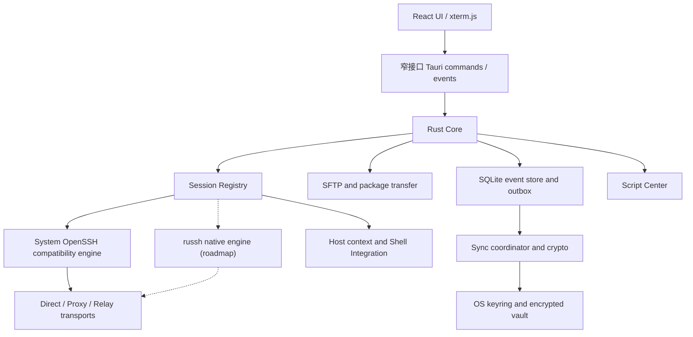

# VPShell 架构设计

> 文档状态：面向 v0.1.0 Alpha 和后续产品化路线。除“v0.1.0 已实现”一节明确列出的内容外，本文其余部分是目标架构，不代表当前版本已经交付。

VPShell 是一个 Windows-first、最终覆盖 Windows、macOS 和 Linux 的 SSH 运维工作台。产品目标不是重新实现一套密码学或 SSH 协议，而是在成熟 SSH 实现之上，把多终端、文件传输、历史、脚本、主机上下文和用户可控的加密同步组合成一个轻量、可审计的桌面应用。

## 1. 设计原则

1. **Windows-first，不绑定 Windows**：先保证 Windows 自用场景稳定，再持续验证 macOS/Linux。核心数据格式、同步协议和业务模型保持平台无关。
2. **兼容优先**：当前使用系统 OpenSSH，以直接复用用户已有的 `ssh_config`、`known_hosts`、agent 和密钥生态；原生 SSH 引擎必须达到兼容性门槛后才成为可选项。
3. **本地优先**：断网时连接资料、历史、脚本和文件操作仍可使用。同步是本地数据库之上的复制层，不是应用运行的前置依赖。
4. **远端存储零信任**：WebDAV、网盘目录、SFTP、S3 或自建网关只保存客户端加密对象，不能看到业务明文和解密密钥。
5. **危险状态持续可见**：当前主机、跳板链、生产环境、广播目标和破坏性脚本不能只用短暂提示表达。
6. **能力探测与回退**：打包传输、Shell Integration、原生 SSH 和中继均允许缺失或失败，并有明确的兼容路径。
7. **不夸大“无限”和“加速”**：历史不设产品级条数上限，但仍受磁盘和用户保留策略约束；没有实际中继基础设施时不称为海外线路加速。

## 2. v0.1.0 已实现

v0.1.0 是进入实机验收的桌面 Alpha。当前真实实现如下。

| 模块 | 已实现 | 当前限制 |
| --- | --- | --- |
| 桌面框架 | Tauri 2、React 19、TypeScript、Vite；Windows/macOS/Linux CI；首个原生 runner Alpha Release 已发布 | 安装与升级仍需扩大实机覆盖；Windows 无 Authenticode，macOS Alpha 使用 ad-hoc 签名且未公证 |
| 终端 | xterm.js，多标签会话，输入输出、窗口大小调整、断开连接，单终端 250,000 行 scrollback | scrollback 不是持久化的“无限历史” |
| SSH | Rust 后端通过 `portable-pty` 启动系统 `ssh`；支持端口、`-i` 私钥路径、keepalive 及直连 AskPass | 当前只支持直连；依赖系统 `ssh` 在 PATH 中；主机密钥提示由 OpenSSH 处理；没有原生端口转发和结构化认证状态 |
| 主机与会话 | 主机分组、环境标签、最近连接、会话切换；OpenSSH 采集 Linux `/proc` 概况；v0.2 工作树可显式启用 bash/zsh 自报上下文栈 | Integration 不支持 fish/PowerShell，也不把远端自报 hostname 当作已验证身份；监控仅支持 Linux |
| 多终端输入 | v0.2 Compose 广播由 Rust 冻结目标/命令/上下文，所有目标均需预览，生产持续标记，认证和已知危险命令阻止 | 不是完整的原始按键同步；成功只表示 PTY 写入，不能结构化证明远端命令成功 |
| 历史 | 命令、SFTP 路径和连接尝试历史由 Rust SQLite schema v1 快照/事件元数据管理；首次启动一次性迁移旧 WebView 状态 | SSH 进程启动不代表认证成功；SQLite 本地快照尚未作为同步包，终端内 `cd` 只由显式 Shell Integration 上报 |
| 命令库 | 22 项本地命令/工具；中文意图匹配、参数表单、POSIX 参数引用、风险与执行前预览 | 不是自然语言模型；自建命令编辑、命令版本和 secret 参数仍未实现 |
| 脚本中心 | 内置脚本资料、风险标签、来源链接、复制/加入命令栏；可添加自建脚本 | 没有哈希锁定、签名、版本更新或安全执行沙箱 |
| 凭据与密钥 | FinalShell 密码只写入 OS keyring；直连终端、采样和 SFTP 可使用凭据引用；生成 Ed25519/RSA4096 OpenSSH 密钥；可安装所选公钥；删除主机进入 30 天回收站，永久删除或到期时清理未共享凭据 | 凭据尚不能同步或单独编辑；跳板逐跳凭据尚未实现 |
| 网络诊断 | 本机 traceroute、有限额 HTTP 下载测速、iperf3 UDP 正反向测速 | iperf3 需用户自行安装并启动服务端；没有后台定时采样或路线自动选择 |
| 终端背景 | Rust 资产管理器校验 PNG/JPEG/WebP 魔数、8 MiB 上限、符号链接和原子缓存；HTTPS 壁纸无凭据/query/fragment且不跟随重定向；WebView 只渲染受管 data URL | 不做通用图片重编码；远程地址必须用户主动应用，真实 CDN 兼容性仍需平台验收 |
| 文件面板 | 真实 SFTP 列表、递归上传下载、拖放、进度、暂存校验与原子提交；`tar + zstd` 回退；后端任务恢复/取消；v0.2 工作区的目录、重命名、跨目录移动、递归权限和批量删除操作 | 已发布 Alpha 尚无文件变更操作；暂无字节级断点续传；移动覆盖策略不适用于普通上传；SFTP 不支持 ProxyJump |
| 外部编辑 | SFTP 下载受管临时副本，Rust 适配 Notepad++、VS Code/VSCodium、自定义/系统编辑器，检测保存并比较远端哈希后回传；v0.2 工作树提供重启恢复与冲突中心 | 仅普通文件且不超过 64 MiB；ProxyJump 尚未实现，Windows/macOS 编辑器仍需实机验收 |
| 配置迁移 | FinalShell 可选密码进入 OS keyring；v0.2 工作树提供 OpenSSH、PuTTY、Xshell、SecureCRT、MobaXterm、Tabby、Termius 非敏感字段预览/导入 | 厂商版本差异需真实客户端导出验收；不导入其他应用 vault、Token、私钥内容或隐式主机信任 |
| 同步 | Local/WebDAV/SFTP/S3/Gateway 的配置草稿界面和二级密码/TOTP 开关 | 只保存本地草稿；没有网络访问、端到端加密、自动同步或冲突合并 |

当前工作树已将 CSP 设为显式指令集，`object/frame/form` 禁止，脚本只允许 bundled self；capability 只绑定 `main` 窗口和实际使用的自定义命令/插件动作。SQLite 快照、资产缓存和事件元数据由 Rust 管理，但本地数据库未加密，不能把 v0.1.0 当作生产密码管理器。

## 3. 目标分层



WebView 只负责展示和用户交互。网络、文件系统、密钥、远程命令启动、同步加密和解压均属于 Rust 边界。产品化前必须启用 CSP、缩小 Tauri capability，并避免把任意文件系统或凭据接口直接暴露给前端。

## 4. SSH 双引擎策略

### 4.1 System OpenSSH compatibility engine

这是 v0.1.0 的当前引擎，也是近期版本的默认兼容路径：

```text
xterm.js <-> Tauri IPC <-> portable PTY <-> system ssh <-> target
```

它的价值是兼容用户已经工作的 OpenSSH 配置、密钥格式、agent 和主机密钥策略。当前 Alpha 只组装直连参数；ProxyJump 在逐跳凭据模型完成前不对用户开放。后续需要增加：

- 可选择的配置文件和 profile 解析结果预览；
- 密码、私钥口令和交互式认证的安全输入通道；
- 明确区分应用参数与用户配置产生的最终连接路线；
- 连接超时、取消、诊断和结构化退出原因；
- 对 Windows OpenSSH 缺失或版本过旧的可操作提示。

兼容引擎的信任源继续使用 OpenSSH `known_hosts`。alpha.5 起使用隔离临时 `known_hosts` 的无凭据系统 OpenSSH 握手读取公开主机密钥，并用 `ssh-keygen` 查询含哈希条目的本机信任库；KEX 列表只取当前 `ssh -Q kex` 实际报告且不含 SHA-1 的交集。匹配时继续，未知时展示算法和 SHA256 指纹并由用户明确确认保存，换钥时硬阻止。alpha.6 将确认路径收敛为一次远端重扫和一次本地写入校验，随后直接启动仍强制 `StrictHostKeyChecking=yes` 的终端，避免低配或限流主机被重复预认证连接压垮。SFTP 与监控复用同一信任结果。应用不能自动回答 `yes`，也不能把主机换钥警告降级成普通终端文本。

当前终端、SFTP 和 Linux 概况仍是三条独立 SSH 连接。alpha.4 将它们按终端、SFTP、概况的顺序错峰启动，减少低配主机的预认证突发；长期方案是原生会话引擎在一次认证后的主连接上复用 Shell、SFTP 和监控通道。

v0.2 工作树把概况调度从 WebView 定时器收归 `remote_monitor.rs`。每个活动终端会话对应一个 Rust 监控记录，启动请求逐字段验证会话标识、连接资料和 5 至 300 秒间隔；全局最多保留 16 个记录和 16 个工作线程。采样仍使用固定、无用户插值的 Linux `/proc` 脚本和 12 秒进程超时。前端收到的快照只包含指标、运行状态、诊断和最近 120 个趋势点，不包含密码、私钥或 credential ref。

暂停不会发起新连接；若暂停发生在一个 OpenSSH 子进程已经启动之后，该进程受原有超时约束完成，但结果不进入历史。停止、活动标签切换或同一会话重新启动会移除/替换代际，迟到结果无法重新写入。历史淘汰数随快照报告，失败保留最后一条可理解诊断但不用零值制造成功样本。当前历史是有界运行时观测数据，不跨应用重启持久化。

### 4.2 russh native engine

原生引擎是 roadmap，不在 v0.1.0 中。目标技术栈是锁定版本的 `russh + Tokio`，SFTP 使用 `russh-sftp`。它用于获得结构化的主机密钥确认、SFTP、逐跳连接、端口转发、取消和进度控制。

核心接口对 UI 保持一致：

```text
connect(profile, route) -> session_id
open_terminal(session_id, pty) -> byte stream
write / resize / close
open_sftp(session_id) -> transfer channel
open_forward(session_id, policy) -> lease
```

原生引擎的最低安全要求：

- 未知主机展示目标、算法和 SHA256 指纹，允许“仅本次”或“信任并保存”；
- 主机密钥不一致时硬阻止，不能静默替换；
- 每个跳板和最终目标分别校验；
- 每条连接、PTY、传输和转发都有取消令牌、超时及有界队列；
- 终端字节原样传输，不能按行解析或在 UI 跟不上时丢弃字节；
- FIDO/U2F、PKCS#11、GSSAPI、Pageant 等尚未达到兼容性时，明确回退系统 OpenSSH。

`russh` 仍处于 `0.x` 版本阶段。引入时必须锁版本，并对 OpenSSH 多版本、旧服务器、双跳板、换钥、转发和大流量建立集成测试。

### 4.3 凭据边界

主机配置只保存 `credential_ref`，不直接保存密码或私钥正文。目标实现使用 Windows Credential Manager、macOS Keychain 或 Linux Secret Service 保存短凭据和数据密钥；私钥保留为用户选择的加密 key 文件，或放入独立加密 vault。敏感内存使用可清零容器。

v0.1.0 可把用户选择迁移的 FinalShell 密码和可选私钥口令保存到 OS keyring。React 侧只持久化随机 `credential_ref`；直连 OpenSSH AskPass、采样和 SFTP 在 Rust 边界内按当前主机读取，密码明文不作为 IPC 返回值。私钥正文只写入用户选择的 OpenSSH 文件，不进入 `localStorage`。

v0.2 的其他客户端迁移使用 `MigrationPreviewRequest` 和 `MigrationApplyRequest` 两阶段 IPC。Rust 显式选择解析器，只读扫描用户选择的普通文件/目录，严格解码 UTF-8/UTF-16，并冻结最多五分钟、单次使用的净化资料。前端只能展示逐项/逐字段报告并提交令牌，不能回传自行拼装的 profile 作为已确认结果。源路径、单文件、总字节、文件数、目录/JSON 深度、资料数和报告数均有硬上限；符号链接不跟随。密码、Token、私钥路径/正文、厂商 vault 和 known_hosts 信任不进入预览。

本地业务状态 IPC 只接受 `InitializeAppStoreRequest`/`SaveAppStateRequest` 具名结构体。SQLite 使用 `user_version=1`、`app_state` 单例快照和不含值的 `app_events` 变更域；每次保存以 expected revision 防止覆盖，事务提交后再保留最多 10,000 条/90 天事件。超过 64 MiB 或 quick_check 失败时，Rust 按时间戳隔离原库并最多保留两个备份。状态校验拒绝未知顶层字段、过深/过大 JSON、控制字符、私钥正文和密码/Token/secret 等值字段；`credentialRef` 仅作为本地引用，不进入事件域或同步包。

## 5. 主机身份链与 Shell Integration

“当前在哪台机器”必须是终端第一等状态，而不是依赖标题或用户记忆。

### 5.1 身份来源分级

| 来源 | 示例 | 可信度表达 |
| --- | --- | --- |
| 应用管理的路线 | `本机 -> 香港跳板 -> 新加坡生产` | 已配置；每跳连接成功且密钥已验证后可标记“已验证路线” |
| Shell Integration 上报 | 远端 shell 上报 hostname、user、cwd | 标记“Shell 上报”，不把 hostname 当作已验证 IP |
| 配置推断 | 当前 profile 的别名、IP、环境 | 标记“配置”，不能冒充实时状态 |
| 屏幕文本猜测 | 解析 prompt 或 `ssh` 命令 | 只作辅助提示，绝不作为安全判断 |

系统 OpenSSH 的 `-J` 链由应用配置得知，但用户进入远端后手动执行 `ssh other-host` 时，客户端只看到终端字节流，无法可靠判断嵌套目标。v0.2 工作树提供显式启用的 bash/zsh 轻量 Shell Integration；fish/PowerShell 仍未实现。当前受限终端控制序列上报：

- 随机会话标识和握手 nonce；
- `hostname`、用户和当前目录；
- 每次 prompt 前的当前上下文；
- 在每层 shell 显式启用后，进入或退出嵌套 SSH 时的新旧上下文。

每个终端由 Rust 生成 128-bit 随机令牌。解析器跨 PTY 分块识别 `OSC 777`，逐字段 base64 解码并限制 hostname 255 字节、user 128 字节、cwd 4096 字节、整帧 8 KiB 和上下文 8 层；令牌不匹配或格式错误的序列作为普通终端输出保留。应用按 hostname/user 的已知祖先维护 push/pop 栈，不能从屏幕文本猜测上下文。

令牌用于区分普通输出和当前注入函数，不是远端信任证明。同一远端账户下的进程可以读取 shell 函数并伪造上报，所以界面明确称“Shell 上报”，host-key、凭据绑定、生产授权和广播环境仍以配置与 SSH 信任链为准。用户应在确认已经进入 shell 后点击“识别当前 Shell”；应用不会在认证提示阶段自动注入。

### 5.2 持续可见的界面

目标终端顶部始终显示：

```text
本机 > 香港跳板 ops@192.0.2.18 > 新加坡生产 root@203.0.113.42
当前上报: root@prod-sg-02:/opt/services    环境: 生产
```

生产环境使用持续边框和文字标签，不能只依赖颜色。身份来源、真实配置地址和上报 hostname 分开显示。v0.1.0 发布物只有配置级路线与环境标签；上述 Shell Integration 存在于未发布 v0.2 工作树。

## 6. 多终端广播的安全模型

v0.1.0 已有“选中会话后发送一条命令”的基础实现。产品化广播分为两种模式：

1. **Compose 模式**：先完整编辑一条命令，再一次发送到选中目标。它是默认模式，也最适合审计和危险命令确认。
2. **Raw input 模式**：像 Xshell 一样同步按键，只在显式开启后使用。密码、passphrase、全屏 TUI 和不一致 prompt 场景默认暂停。

广播开启后必须持续显示目标数量、别名、IP、环境和连接状态，并用醒目边框包围终端区域。目标变化需要用户确认，新增生产主机不能静默加入。

安全规则：

- 密码和私钥口令进入独立的单会话安全输入通道，永不广播、永不进入历史；
- Shell Integration 的 `prompt ready` 是主要就绪信号，`Password:` 等字符串匹配只能作辅助，不能作为安全边界；
- 生产环境、跨环境广播和高风险命令需要二次确认；破坏性脚本默认禁止广播；
- 显示每个目标的发送、退出码和超时结果，不假设多主机操作具备事务回滚；
- Alt Screen、文件编辑器或交互程序中的 Raw input 默认不参与新目标；
- 支持一键退出广播，退出后清空目标集合，避免下次误发送。

v0.2 工作树只开放 Compose 安全广播，不开放 Raw input。Rust 后端验证命令不含控制字符且不超过 4096 字节，目标为 1–32 个当前连接会话；预览冻结命令、会话和 Shell 上下文代际，使用两分钟单次令牌。所有广播都必须再次确认，生产目标额外高亮。确认后目标断开或上下文变化会逐项跳过，写入成功只表示命令进入该 PTY 输入流，不冒充远端执行成功或事务提交。

`sudo`、`su`、`passwd`、`ssh`/`sftp`/`scp` 等可能触发认证交互的命令禁止广播，键盘输入仍只进入当前单个终端。递归强制删除、格式化、关机、清空防火墙和下载管道到 shell 等已知破坏性形式直接阻止；规则是额外防护而不是 shell 语义证明，未知危险命令仍要求人工审查。退出广播或发送后清空目标集合。v0.1.0 已发布产物仍只有基础广播，不能据此宣称具备这些保护。

## 7. 文件与打包传输

目标传输引擎使用独立 SSH/SFTP 通道；大任务默认可使用独立连接，避免同一 SSH 连接中的大流量阻塞交互终端。

### 7.1 传输决策

```text
单个小文件                     -> SFTP
目录 / 大量小文件 / 文本集合
  remote has tar + zstd        -> tar stream + zstd
  capability missing           -> recursive SFTP
  packaging/transfer failed    -> stop with diagnostics
```

上传时由 Rust 客户端生成 tar+zstd 流，不要求 Windows 本机安装 `tar` 或 `zstd`。远端先写入随机临时目录，校验清单后再移动到目标位置。下载时远端打包，客户端流式接收和安全解压。当前仅在探测到远端缺少 `tar`/`zstd` 时回退 SFTP；打包、传输、解包或提交阶段失败会停止并报告错误，避免静默重复写入。

传输协议必须做到：

- 对每个文件显示进度、总进度、速度、错误和回退原因；
- 使用 `.part` 或临时目录，完成并校验后再提交；
- 文件名作为结构化参数处理，不拼接未经转义的 shell 字符串；
- 解压拒绝绝对路径、`..`、盘符路径、越界符号链接和硬链接；
- 可选 SHA256/BLAKE3 校验，失败时保留诊断但不覆盖目标；
- 取消后清理临时文件，清理失败要显式报告；
- 后续再增加断点续传、差量传输和通用覆盖策略。

传输不再由文件面板局部状态代表。Rust `TransferManager` 最多并发运行 6 个任务，保存带单调序号的可查询快照；WebView 丢失事件、关闭文件面板或切换主机后，可以通过任务 ID 和连接身份恢复显示。终态记录有界保留，用户可以显式清除。

取消会先进入 `cancelling`，再关闭当前传输 TCP 克隆以打断 libssh2 阻塞 I/O。目录扫描、复制、哈希、压缩和安全解压都有协作检查点。递归模式已经原子提交的文件不会被反向删除，而是报告 `partialCommit`；打包模式进入最后一次重命名提交后拒绝取消。远端临时路径全部由 Rust 生成，原会话清理失败时只允许一次有界重连重试，最终清理警告进入任务快照。

### 7.2 跨应用重启恢复（v0.2 工作区，待发布）

`TransferManager` 在 Rust 后端应用数据目录下维护 `transfer-recovery` 存储。每次快照使用带 `schemaVersion` 的 JSON 信封，写入随机临时文件、同步文件后以唯一文件名原子重命名；目录只保留最近两个有效快照，单个状态文件不超过 1 MiB、记录最多 200 条，记录超过 30 天在启动时清理。损坏、截断或不支持的版本不会阻止启动：系统回退到最近有效快照并在恢复状态中显示清理警告。

持久化只包含恢复所需的最小元数据：任务 ID、方向、主机/端口/用户名、源/目标路径、打包开关、阶段、重试次数和是否跨过提交边界。不会写入密码、私钥、credential ref、私钥路径、原始连接秘密或文件内容；任务完成、取消或确认不可重试后会移除请求路径元数据。活动任务在启动后统一显示 `interrupted`，不会自动继续。

用户必须明确选择重试或丢弃。未跨提交边界且仍有请求元数据的任务最多允许 3 次应用级重试，重试要求当前连接身份匹配、可取消且每次转为队列前先持久化状态。递归文件提交和打包最终重命名前会先持久化不可重放边界；边界后的任务即使进程异常退出也只显示核对/丢弃，防止重复覆盖或重放已提交工作。该机制不提供断点续传，也不替代外层 supervisor 的连接重试。

### 7.3 文件坞变更与批量安全（v0.2 工作区，待发布）

远端变更由独立 Rust `remote_file_ops` 模块执行。WebView 只能发送带 `operation` 标签的结构化请求；新建目录拆分为父路径与名称，重命名拆分为源路径与新名称，移动拆分为源路径数组、目标目录与枚举冲突策略，权限和删除使用有界路径数组。模块直接调用 SFTP 文件 API，不接受或拼接任意 shell 命令。

每次操作先连接并生成不可变预览，保存路径类型、权限和修改签名；预览令牌绑定主机/端口/用户，两分钟过期、最多保留 32 个且只能消费一次。前端在目录或选择变化后废弃预览，并要求两次明确确认；执行前 Rust 再逐项读取签名，目标已出现、源已变化或目录清单变化时只跳过该项，不沿用旧确认覆盖新状态。

变更路径必须是规范绝对路径，根目录本身、`.`、`..`、重复分隔符、控制字符、反斜杠、超长组件和超过 64 层的路径被拒绝；批量最多 128 个互不重叠的根，递归源/目标合计最多 10,000 个条目。重命名限同目录且不覆盖已有目标；SFTP rename 显式移除库默认的 `OVERWRITE` 标志。移动提供 `fail`、`rename` 和明确 `overwrite`，禁止移动到自身子目录、复制符号链接/特殊条目，单文件最多 64 GiB、单批最多 256 GiB。跨目录移动始终在目标目录建立随机暂存树，逐文件再次读取源并进行大小/SHA-256 核验；提交前重新核对源、目标与父目录，覆盖时先原子备份旧目标，提交失败尝试回滚，提交后才清理源和备份。

权限只允许 `000..777`，不设置 setuid/setgid/sticky；递归权限先冻结有界清单，符号链接保持不变。递归删除符号链接时只删除链接自身；按预览清单由深到浅执行。所有批量操作逐项报告成功、失败、跳过、取消和部分完成。文件操作复用 `TransferManager` 的原子恢复记录与取消检查点：复制暂存阶段可取消，单项原子提交期间暂时拒绝取消，提交后可取消剩余项；应用重启后只允许重新连接并生成新预览或丢弃，任何已提交/最终化任务都不会重放。

### 7.4 外部编辑恢复与冲突（v0.2 工作区，待发布）

`ExternalEditorManager` 在应用数据目录维护 schema v1 的 `external-edit-recovery` 快照。写入使用随机临时文件、文件同步和原子重命名，只保留最近两个有效版本；最多 16 条、单快照 128 KiB、14 天后清理。损坏、截断或未知 schema 回退到最近有效快照并向冲突中心报告。持久字段仅包括会话 ID、主机/端口/用户名、远端路径、受管缓存文件名、远端基线指纹、时间和冲突标志，不包含 credential ref、私钥/私钥路径、编辑器路径或文件内容。

恢复不会自动联网或回传。用户连接到相同主机、端口和用户名后才可把当前运行时凭据重新绑定到记录；本地缓存必须仍是受管目录中的非符号链接普通文件。冲突中心提供校验后无覆盖另存、重新下载、明确强制覆盖和丢弃。远端保存继续使用随机 `.part`、上传哈希核对、提交前二次远端版本检查、原子覆盖和提交后回读；应用重启不会重放任何保存或最终提交。

编辑器命令行由 Rust 适配器生成：Notepad++ 使用固定无会话参数，VS Code/Code Insiders/VSCodium 使用固定复用窗口参数，自定义程序只接收一个受管文件路径。WebView 不能提供附加参数或 shell 字符串。

### 7.5 Android Preview 共享契约（Phase C，第一项）

`android_preview.rs` 在 Rust 信任边界建立平台无关的 schema-v1 manifest、结构化主机请求和生命周期运行时。manifest 固定 `NativeRustSshSftp` 引擎，最多 8 个会话；当前只启用主机连接、终端、SFTP 与凭据 vault，同步在协调器接线前与广播、外部编辑、常驻监控和后台长连接一样显式 disabled。主机请求只传 UUID、受限 host/user/port、固定 host-key 与 `ssh-<UUID>` 或 `key-<UUID>` 不透明引用，不传秘密值。

运行时只有前台且解锁时允许建立会话或调用支持的操作；任何非前台状态都会增加 generation、清空原生连接并拒绝迟到的连接结果。`android_native_transport.rs` 直接使用 Rust `ssh2`/libssh2 API，握手后先校验固定 SHA-256 host-key，再执行清零密码/内存私钥认证，并提供有界 PTY I/O 与不跟随链接的 SFTP 列表。`android_mobile.rs` 是单独的 Tauri IPC/会话 owner，Android capability 不包含桌面 OpenSSH PTY、广播、编辑器、监控、updater/process/dialog。移动密码和私钥只写入 Android Keystore-backed store；manifest 禁止 backup/cleartext/FileProvider，Activity 设置 `FLAG_SECURE`。Linux 已构建 debug APK/AAB，但同步、生物识别、真机 Keystore/生命周期和真实 SSH/SFTP 仍未验收。

## 8. 历史与本地数据模型

目标本地存储为 SQLite。所谓“无限历史”指产品不设置固定条数上限，实际仍受磁盘、隐私模式和用户保留策略约束。xterm scrollback、命令历史和路径历史是三个不同的数据域。

历史采用追加事件模型：

```text
HistoryEvent
  event_id       UUIDv7
  device_id      事件来源设备
  seq            设备内单调序号
  hlc            Hybrid Logical Clock
  kind           command_started | command_finished | path_observed |
                 parameter_used | session_opened | session_closed | script_run
  host_id        稳定主机 ID
  session_id     本地会话 ID
  cwd            可选远端目录
  payload        按 kind 定义的结构化内容
  privacy        normal | redacted | private
```

每次业务写入与对应的同步 outbox 必须在同一 SQLite 事务完成，避免应用崩溃后出现“本地成功但永远不同步”。命令事件按 `event_id` 合并，不依靠可变的“最新命令列表”。

隐私要求：

- 支持全局、按主机和按会话关闭历史；
- 提供 private session、快速删除、保留期限和磁盘上限；
- 参数模板可将字段标记为 secret，secret 值不进入历史或同步；
- 敏感模式匹配只用于提醒/脱敏，不能保证发现全部 token 或密码；
- 本机路径按平台和设备隔离，远端路径才按主机同步；
- 删除生成 tombstone，确保其他设备不会把旧事件重新带回。

详细的复制和冲突规则见 [SYNC.md](./SYNC.md)。

## 9. 脚本中心

v0.1.0 已收录 SafeVPS、Nginx Easy Deploy、VPS Health Check 及若干社区检测/调优入口，并支持用户保存自建脚本。当前执行方式是复制或填入命令栏。

目标 `ScriptRecipe` 是版本化清单，而不是一段没有来源的文本：

```text
id / version / title / description / source
supported_os / shell / requires_root
command_template / parameter_schema
risk / broadcast_policy
source_commit / expected_hash / signature (optional)
attachments / changelog
```

执行流程为“选择版本 -> 填参数 -> 展示最终命令与目标 -> 风险确认 -> 执行 -> 记录结果”。参数按 shell 类型安全转义，不做简单字符串拼接。密码、API key 等 secret 参数只在内存中存在。

来自 URL 的脚本在执行前应下载到本地安全缓存，显示最终内容、来源、重定向后的 URL 和哈希；能固定 commit/hash 时不跟随可变的 `main`。明文 HTTP 来源必须高亮阻止默认执行。DD 重装、磁盘格式化等破坏性配方要求逐台输入目标确认，不能广播执行。

所有自建脚本、参数模板和附件进入加密同步；内置目录的版本与用户修改分开，升级不能覆盖用户副本。

## 10. 同步子系统

同步后端按不可变对象抽象，不上传 SQLite 整库。当前未发布工作树的 `sync_crypto` 已实现 schema v1 keyslot/对象信封、Argon2id v19 参数边界、XChaCha20-Poly1305 认证加密、HKDF-SHA256 的 event/blob/index/checkpoint/device-registry 域分离、OS 随机 salt/nonce、秘密清零和有界严格解析；固定输入只用于稳定测试向量。对象 AAD 绑定 vault、对象类型/ID、设备/序号、算法与长度，keyslot AAD 绑定全部 KDF 参数。

`sync_provider` 已定义 Rust-only、有界、可取消的不可变 `list/get/put` 接口。Local Folder 逐级隔离符号链接，以同目录暂存、`fsync`、原子无覆盖 hard-link 和回读保持提交语义；WebDAV 强制 HTTPS/无重定向/有界显式 CA 和总超时，使用结构化 XML、条件 PUT 与提交后回读。对象最多 24 MiB，key/深度/分页/扫描/XML 均有硬限制，错误码区分取消、输入、路径、缺失、冲突、资源、服务和协议。两模块尚未连接同步 UI、outbox、设备 head 或协调器，不能单独提供同步或重放保护。

`sync_outbox` 在独立的 schema-v1 `vpshell-sync.sqlite3` 中原子写入加密 operation、outbox 和同事务业务回调。两分钟 claim 租约、最多六次 2 秒起/5 分钟封顶退避、显式暂停/恢复、不可逆发布态和过期租约恢复都由 SQLite 状态机拥有；前端不能提交或改写状态。远端对象在 Rust 内完成信封解析/AEAD 后，业务合并、receipt 和每设备连续序号 head 同事务提交；key/hash/对象身份唯一性阻止无序号对象换 key 重放。journal 的 10,000 未发布项/256 MiB、50,000 总对象/384 MiB、512 MiB 文件、30/90 天保留和两份损坏隔离备份均为硬边界。损坏恢复默认 `reconcile-required`，不会静默恢复上传。协调 worker、provider 接线、哈希链和设备签名仍未实现。

`sync_merge` 已实现 version 1 operation/state、HLC/device/operation 确定性字段 register、history event 并集、因果 tombstone 和冲突中心。host/script/setting/background 只有逐字段类型/范围白名单；host trust pin、credential ref、本机背景路径、密码/Token/私钥和敏感参数 history 不属于格式。删除保存 observed-field stamps，使并发编辑/删除在任意到达顺序生成同一冲突；风险降低、连接身份和脚本正文变化也会持续显示。冲突解决自身使用 LWW stamp，支持保持删除或明确恢复。`sync_merge_state` 的 revision、apply 和写回可嵌入 outbox/remote receipt 的同一 SQLite transaction；它尚未连接产品状态或前端冲突界面。

`sync_recovery` 已实现独立的 256-bit 可打印恢复密钥与 recovery keyslot，以及最多 32 台设备的 schema-v1 加密 registry。设备公钥身份不可替换，expected revision、撤销优先合并、最后活动设备保护和已撤销发布者拒绝防止本地静默复活。加密导出只封装 keyslot、认证密文和 manifest，限制为 10,000 对象/256 MiB 密文/384 MiB 文件；Rust 使用私有同目录暂存、文件与目录同步、hard-link 无覆盖提交，读取拒绝符号链接。恢复演练解包 VMK 后逐对象认证，严格解析 event 与 device registry。该模块不持久化恢复密钥、密码、私钥、provider 凭据或明文；设备 operation 签名、远端 registry 回滚防护、VMK 轮换、恢复写入、协调器与 UI 仍未实现。

`sync_credential_vault` 是与业务 VMK 分离的 Rust-only 可选层。策略默认关闭，expected revision 与 business device registry 共同控制最多 32 个活动/撤销授权，撤销单调且要求 CVK 轮换。独立随机 CVK 不可序列化/调试并清零，以 `credentials` 密码 keyslot 包裹；SSH 密码、私钥口令、OpenSSH 私钥和 access token 分别进入独立 HKDF/AAD 域的严格认证信封。本机 credential reference 只用于一次性 Rust 读取且不写入信封/object key/诊断。静态回归禁止该模块出现 Tauri command、事件或日志宏；系统钥匙串写回、provider/outbox、CVK 恢复/轮换、协调器与 UI 仍未实现。

后续 provider 包括 SFTP、S3 兼容存储和自建 Gateway；网盘可通过已实现的 Local Folder 基础层或后续 rclone 适配。事件段先 zstd 压缩，再进入已实现的认证加密信封；二级密码用 Argon2id 包裹随机 Vault Master Key。

`sync_provider_ext` 已把 SFTP、S3-compatible 与 Gateway 作为三个专用 Rust transport trait 接入 `SyncObjectProvider`。公共适配层重新验证最多 10,000 项的 list 响应、key/游标/前缀/ETag/24 MiB 大小，拒绝 SFTP 符号链接/特殊对象，执行取消、条件无覆盖创建和提交后无取消回读。SFTP 无秘密配置要求绝对非根路径与固定 host-key SHA-256；S3/Gateway 要求无 URL 凭据/query/fragment 的 HTTPS endpoint。Gateway 登录 secret 使用清零容器，只在 authentication call 中借用，session 不保存 TOTP且底层错误净化。当前 transport 使用内存协议夹具验证契约；真实 ssh2 SFTP 会话、SigV4 HTTP 和 Gateway HTTP 客户端尚未接入，因此不能宣称外部服务兼容。

同步的对象、密钥层级、冲突规则、TOTP 边界和恢复流程见 [SYNC.md](./SYNC.md)。v0.1.0 的同步页面只是配置原型，没有实现这些机制。

## 11. 中继与“智能加速”的边界

SSH 参数调优、压缩或连接复用不能等同于海外线路加速。真正改善跨境高延迟/丢包通常需要位于更好线路上的中继节点、自动测速和路由选择。

目标传输路线按阶段支持：

1. Direct；
2. OpenSSH ProxyJump；
3. SOCKS5 / HTTP CONNECT；
4. 用户自建 VPShell Relay；
5. 可选托管中继和自动测速选路；
6. Mosh 作为独立交互模式，要求远端 `mosh-server` 和 UDP，不替代 SFTP/转发。

中继只能承载到目标的 SSH 密文字节，不能终止最终 SSH、读取凭据或替代目标主机密钥验证。客户端持续测量 DNS、TCP/隧道建立、SSH 握手 RTT、丢包/重传和吞吐，按策略选择路线；自动切换必须显示原因，并允许锁定直连或指定中继。

没有部署和实测中继时，界面只能称“直连”“代理”“跳板”或“连接优化”，不能宣称“海外智能加速”。v0.1.0 当前只支持系统 OpenSSH 直连，没有 ProxyJump、测速选路或加速服务。

## 12. 跨模块安全基线

- 远端终端输出不可信。OSC 52 剪贴板、外链、窗口操作和标题必须拦截、确认或转成纯文本。
- URL 背景由 Rust 无 Cookie、无 Referer 下载，限制协议、重定向、大小、像素和 MIME；拒绝 SVG，解码后重编码为安全位图，再按哈希缓存。
- 所有压缩包、远端路径和文件名均不可信，安全解压规则不能由 UI 开关关闭。
- 同步来的主机密钥变化只能进入冲突中心，不能覆盖本地 trust pin。
- 非回环端口转发、远端 `0.0.0.0`、agent forwarding 和 ProxyCommand 都属于高风险能力；ProxyCommand 等同于本机代码执行，不进入首批原生功能。
- 更新包和正式发布物需要签名；日志默认不记录凭据、完整终端内容或解密后的同步对象。

## 13. 路线图与交付门槛

| 阶段 | 重点 | 进入下一阶段前的门槛 |
| --- | --- | --- |
| v0.1.0 原型 | Tauri/React/xterm、系统 OpenSSH PTY、多会话、基础广播与产品界面 | 已有代码；只用于验证，不宣称生产安全 |
| 本地基础 | SQLite 事件库、OS keyring、CSP/capability 收紧、真实主机/历史管理 | 数据迁移、崩溃恢复和凭据泄露测试通过 |
| 传输与上下文 | 真实 SFTP、tar+zstd 回退、Shell Integration、持久身份链、安全广播 | 多平台 OpenSSH、恶意文件名/压缩包和嵌套 SSH 测试通过 |
| 加密同步 | Local Folder + WebDAV、E2EE、冲突中心、恢复密钥 | 多设备离线冲突、远端篡改/删除/回滚演练通过 |
| 扩展 provider | SFTP、S3、Gateway、TOTP 登录、附件分块 | Provider 兼容矩阵和限流/故障恢复通过 |
| 原生 SSH | russh、原生 SFTP/跳板/转发；结构化 host key 已由兼容层先行实现 | 与系统 OpenSSH 的认证及服务器兼容测试达标，随时可回退 |
| Android Preview | Tauri 2 Android 壳、触屏终端、原生 SSH/SFTP、Android Keystore、加密同步 | arm64 真机、网络切换/休眠恢复、软键盘、凭据与 Android 生命周期测试通过 |
| 路线优化 | SOCKS/HTTP、自建 Relay、测速选路、可选 Mosh | 有实际节点、公开指标与隐私边界后才使用“加速”表述 |

每个阶段都应以可回退、可迁移和可验证为准。路线图不是发布日期承诺，未通过门槛的模块不应仅凭界面存在就标记为已完成。

Android 可以复用 Tauri 2 的 React WebView 与 Rust core，但不能假设存在桌面系统 OpenSSH、PTY、桌面钥匙串、任意本机编辑器或常驻后台进程。移动端通过与 UI 解耦的 `SshTransport`/`SftpTransport` 接口接入原生引擎，凭据适配 Android Keystore；桌面 compatibility engine 继续独立保留。APK/AAB 使用独立 GitHub Actions 工作流与签名密钥，不由桌面 Release 矩阵顺带生成。
