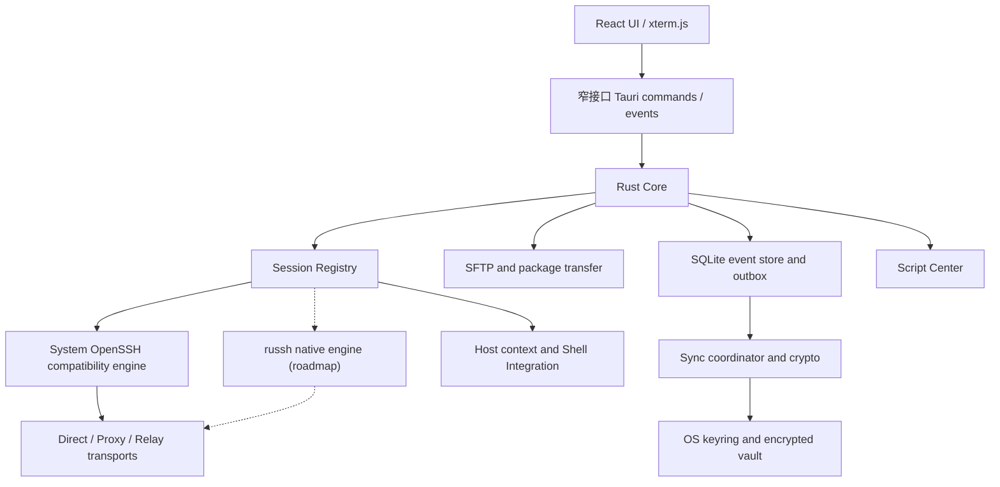

# VPShell 架构设计

> 文档状态：面向 v0.1.0 Alpha 和后续产品化路线。除“v0.1.0 已实现”一节明确列出的内容外，本文其余部分是目标架构，不代表当前版本已经交付。

VPShell 是一个 Windows-first、最终覆盖 Windows、macOS 和 Linux 的 SSH 运维工作台。产品目标不是重新实现一套密码学或 SSH 协议，而是在成熟 SSH 实现之上，把多终端、文件传输、历史、脚本、主机上下文和用户可控的加密同步组合成一个轻量、可审计的桌面应用。

## 1. 设计原则

1. **Windows-first，不绑定 Windows**：先保证 Windows 自用场景稳定，再持续验证 macOS/Linux。核心数据格式、同步协议和业务模型保持平台无关。
2. **兼容优先**：当前使用系统 OpenSSH，以直接复用用户已有的 `ssh_config`、`known_hosts`、agent 和密钥生态；原生 SSH 引擎必须达到兼容性门槛后才成为可选项。
3. **本地优先**：断网时连接资料、历史、脚本和文件操作仍可使用。同步是本地数据库之上的复制层，不是应用运行的前置依赖。
4. **远端存储零信任**：WebDAV、网盘目录、SFTP、S3 或自建网关只保存客户端加密对象，不能看到业务明文和解密密钥。
5. **危险状态持续可见**：当前主机、跳板链、生产环境、广播目标和破坏性脚本不能只用短暂提示表达。
6. **能力探测与回退**：打包传输、Shell Integration、原生 SSH 和中继均允许缺失或失败，并有明确的兼容路径。
7. **不夸大“无限”和“加速”**：历史不设产品级条数上限，但仍受磁盘和用户保留策略约束；没有实际中继基础设施时不称为海外线路加速。

## 2. v0.1.0 已实现

v0.1.0 是进入实机验收的桌面 Alpha。当前真实实现如下。

| 模块 | 已实现 | 当前限制 |
| --- | --- | --- |
| 桌面框架 | Tauri 2、React 19、TypeScript、Vite；Windows/macOS/Linux CI；首个原生 runner Alpha Release 已发布 | 安装与升级仍需扩大实机覆盖；Windows 无 Authenticode，macOS Alpha 使用 ad-hoc 签名且未公证 |
| 终端 | xterm.js，多标签会话，输入输出、窗口大小调整、断开连接，单终端 250,000 行 scrollback | scrollback 不是持久化的“无限历史” |
| SSH | Rust 后端通过 `portable-pty` 启动系统 `ssh`；支持端口、`-i` 私钥路径、keepalive 及直连 AskPass | 当前只支持直连；依赖系统 `ssh` 在 PATH 中；主机密钥提示由 OpenSSH 处理；没有原生端口转发和结构化认证状态 |
| 主机与会话 | 主机分组、环境标签、最近连接、会话切换；OpenSSH 采集 Linux `/proc` 概况 | 手动嵌套 `ssh` 后不会自动识别新主机；监控仅支持 Linux |
| 多终端输入 | 命令栏可选择多个会话并并发发送同一条命令 | 不是完整的原始按键同步；尚无密码提示隔离、生产确认、就绪状态校验和危险命令保护 |
| 历史 | 命令、SFTP 路径和连接尝试历史写入浏览器 `localStorage`；界面可搜索和快速切换 | SSH 进程启动不代表认证成功；未使用 SQLite；终端内 `cd` 不会由 Shell 自动上报；数据未加密 |
| 命令库 | 22 项本地命令/工具；中文意图匹配、参数表单、POSIX 参数引用、风险与执行前预览 | 不是自然语言模型；自建命令编辑、命令版本和 secret 参数仍未实现 |
| 脚本中心 | 内置脚本资料、风险标签、来源链接、复制/加入命令栏；可添加自建脚本 | 没有哈希锁定、签名、版本更新或安全执行沙箱 |
| 凭据与密钥 | FinalShell 密码只写入 OS keyring；直连终端、采样和 SFTP 可使用凭据引用；生成 Ed25519/RSA4096 OpenSSH 密钥；可安装所选公钥；删除主机进入 30 天回收站，永久删除或到期时清理未共享凭据 | 凭据尚不能同步或单独编辑；跳板逐跳凭据尚未实现 |
| 网络诊断 | 本机 traceroute、有限额 HTTP 下载测速、iperf3 UDP 正反向测速 | iperf3 需用户自行安装并启动服务端；没有后台定时采样或路线自动选择 |
| 终端背景 | 支持本机 PNG/JPEG/WebP 和 URL，可调可见度 | 本机图以 Data URL 存入 `localStorage`；URL 由 WebView 直接加载，尚未实现安全下载、重编码和缓存 |
| 文件面板 | 真实 SFTP 列表、递归上传下载、拖放、进度、暂存校验与原子提交；`tar + zstd` 打包及缺少远端工具时的 SFTP 回退 | 打包或传输过程失败不会自动重试 SFTP；暂无取消、断点续传和持久队列；SFTP 不支持 ProxyJump |
| 外部编辑 | SFTP 下载受管临时副本，自动探测 Notepad++/系统编辑器，检测保存并比较远端哈希后回传 | 仅普通文件且不超过 64 MiB；ProxyJump 和应用重启恢复尚未实现 |
| 同步 | Local/WebDAV/SFTP/S3/Gateway 的配置草稿界面和二级密码/TOTP 开关 | 只保存本地草稿；没有网络访问、端到端加密、自动同步或冲突合并 |

当前 `tauri.conf.json` 的 CSP 仍为 `null`，本地业务状态也仍保存在 WebView 的 `localStorage`。二者都是原型阶段的安全债务，不能把 v0.1.0 当作生产凭据管理器。

## 3. 目标分层



WebView 只负责展示和用户交互。网络、文件系统、密钥、远程命令启动、同步加密和解压均属于 Rust 边界。产品化前必须启用 CSP、缩小 Tauri capability，并避免把任意文件系统或凭据接口直接暴露给前端。

## 4. SSH 双引擎策略

### 4.1 System OpenSSH compatibility engine

这是 v0.1.0 的当前引擎，也是近期版本的默认兼容路径：

```text
xterm.js <-> Tauri IPC <-> portable PTY <-> system ssh <-> target
```

它的价值是兼容用户已经工作的 OpenSSH 配置、密钥格式、agent 和主机密钥策略。当前 Alpha 只组装直连参数；ProxyJump 在逐跳凭据模型完成前不对用户开放。后续需要增加：

- 可选择的配置文件和 profile 解析结果预览；
- 密码、私钥口令和交互式认证的安全输入通道；
- 明确区分应用参数与用户配置产生的最终连接路线；
- 连接超时、取消、诊断和结构化退出原因；
- 对 Windows OpenSSH 缺失或版本过旧的可操作提示。

兼容引擎的信任源继续使用 OpenSSH `known_hosts`。alpha.4 在启动系统 OpenSSH 前通过系统 `ssh-keyscan` 读取公开主机密钥，并用 `ssh-keygen` 查询含哈希条目的本机信任库：匹配时继续，未知时展示算法和 SHA256 指纹并由用户明确确认保存，换钥时硬阻止。这样系统 OpenSSH 终端不再被 libssh2 的算法协商能力提前阻断；随后终端仍强制 `StrictHostKeyChecking=yes`，SFTP 与监控复用同一信任结果。应用不能自动回答 `yes`，也不能把主机换钥警告降级成普通终端文本。

当前终端、SFTP 和 Linux 概况仍是三条独立 SSH 连接。alpha.4 将它们按终端、SFTP、概况的顺序错峰启动，减少低配主机的预认证突发；长期方案是原生会话引擎在一次认证后的主连接上复用 Shell、SFTP 和监控通道。

### 4.2 russh native engine

原生引擎是 roadmap，不在 v0.1.0 中。目标技术栈是锁定版本的 `russh + Tokio`，SFTP 使用 `russh-sftp`。它用于获得结构化的主机密钥确认、SFTP、逐跳连接、端口转发、取消和进度控制。

核心接口对 UI 保持一致：

```text
connect(profile, route) -> session_id
open_terminal(session_id, pty) -> byte stream
write / resize / close
open_sftp(session_id) -> transfer channel
open_forward(session_id, policy) -> lease
```

原生引擎的最低安全要求：

- 未知主机展示目标、算法和 SHA256 指纹，允许“仅本次”或“信任并保存”；
- 主机密钥不一致时硬阻止，不能静默替换；
- 每个跳板和最终目标分别校验；
- 每条连接、PTY、传输和转发都有取消令牌、超时及有界队列；
- 终端字节原样传输，不能按行解析或在 UI 跟不上时丢弃字节；
- FIDO/U2F、PKCS#11、GSSAPI、Pageant 等尚未达到兼容性时，明确回退系统 OpenSSH。

`russh` 仍处于 `0.x` 版本阶段。引入时必须锁版本，并对 OpenSSH 多版本、旧服务器、双跳板、换钥、转发和大流量建立集成测试。

### 4.3 凭据边界

主机配置只保存 `credential_ref`，不直接保存密码或私钥正文。目标实现使用 Windows Credential Manager、macOS Keychain 或 Linux Secret Service 保存短凭据和数据密钥；私钥保留为用户选择的加密 key 文件，或放入独立加密 vault。敏感内存使用可清零容器。

v0.1.0 可把用户选择迁移的 FinalShell 密码和可选私钥口令保存到 OS keyring。React 侧只持久化随机 `credential_ref`；直连 OpenSSH AskPass、采样和 SFTP 在 Rust 边界内按当前主机读取，密码明文不作为 IPC 返回值。私钥正文只写入用户选择的 OpenSSH 文件，不进入 `localStorage`。

## 5. 主机身份链与 Shell Integration

“当前在哪台机器”必须是终端第一等状态，而不是依赖标题或用户记忆。

### 5.1 身份来源分级

| 来源 | 示例 | 可信度表达 |
| --- | --- | --- |
| 应用管理的路线 | `本机 -> 香港跳板 -> 新加坡生产` | 已配置；每跳连接成功且密钥已验证后可标记“已验证路线” |
| Shell Integration 上报 | 远端 shell 上报 hostname、user、cwd | 标记“Shell 上报”，不把 hostname 当作已验证 IP |
| 配置推断 | 当前 profile 的别名、IP、环境 | 标记“配置”，不能冒充实时状态 |
| 屏幕文本猜测 | 解析 prompt 或 `ssh` 命令 | 只作辅助提示，绝不作为安全判断 |

系统 OpenSSH 的 `-J` 链由应用配置得知，但用户进入远端后手动执行 `ssh other-host` 时，客户端只看到终端字节流，无法可靠判断嵌套目标。目标方案是在 bash/zsh/fish/PowerShell 中安装可审计的轻量 Shell Integration，通过受限的终端控制序列上报：

- 随机会话标识和握手 nonce；
- `hostname`、用户、当前目录、shell 类型；
- prompt ready、命令开始、命令结束和退出码；
- 进入或退出嵌套 shell 时的新旧上下文。

控制序列必须做长度、字段和频率限制，远端输出始终视为不可信。应用根据新的 prompt 上报维护上下文栈；上报缺失或顺序不完整时显示“上下文未知”，不能伪造一条看似确定的跳板链。

### 5.2 持续可见的界面

目标终端顶部始终显示：

```text
本机 > 香港跳板 ops@192.0.2.18 > 新加坡生产 root@203.0.113.42
当前上报: root@prod-sg-02:/opt/services    环境: 生产
```

生产环境使用持续边框和文字标签，不能只依赖颜色。身份来源、真实配置地址和上报 hostname 分开显示。v0.1.0 目前只有配置级路线与环境标签，尚未实现 Shell Integration。

## 6. 多终端广播的安全模型

v0.1.0 已有“选中会话后发送一条命令”的基础实现。产品化广播分为两种模式：

1. **Compose 模式**：先完整编辑一条命令，再一次发送到选中目标。它是默认模式，也最适合审计和危险命令确认。
2. **Raw input 模式**：像 Xshell 一样同步按键，只在显式开启后使用。密码、passphrase、全屏 TUI 和不一致 prompt 场景默认暂停。

广播开启后必须持续显示目标数量、别名、IP、环境和连接状态，并用醒目边框包围终端区域。目标变化需要用户确认，新增生产主机不能静默加入。

安全规则：

- 密码和私钥口令进入独立的单会话安全输入通道，永不广播、永不进入历史；
- Shell Integration 的 `prompt ready` 是主要就绪信号，`Password:` 等字符串匹配只能作辅助，不能作为安全边界；
- 生产环境、跨环境广播和高风险命令需要二次确认；破坏性脚本默认禁止广播；
- 显示每个目标的发送、退出码和超时结果，不假设多主机操作具备事务回滚；
- Alt Screen、文件编辑器或交互程序中的 Raw input 默认不参与新目标；
- 支持一键退出广播，退出后清空目标集合，避免下次误发送。

当前原型尚未实现上述保护，因此不能把 v0.1.0 广播用于无人工核对的生产批量操作。

## 7. 文件与打包传输

目标传输引擎使用独立 SSH/SFTP 通道；大任务默认可使用独立连接，避免同一 SSH 连接中的大流量阻塞交互终端。

### 7.1 传输决策

```text
单个小文件                     -> SFTP
目录 / 大量小文件 / 文本集合
  remote has tar + zstd        -> tar stream + zstd
  capability missing           -> recursive SFTP
  packaging/transfer failed    -> stop with diagnostics
```

上传时由 Rust 客户端生成 tar+zstd 流，不要求 Windows 本机安装 `tar` 或 `zstd`。远端先写入随机临时目录，校验清单后再移动到目标位置。下载时远端打包，客户端流式接收和安全解压。当前仅在探测到远端缺少 `tar`/`zstd` 时回退 SFTP；打包、传输、解包或提交阶段失败会停止并报告错误，避免静默重复写入。

传输协议必须做到：

- 对每个文件显示进度、总进度、速度、错误和回退原因；
- 使用 `.part` 或临时目录，完成并校验后再提交；
- 文件名作为结构化参数处理，不拼接未经转义的 shell 字符串；
- 解压拒绝绝对路径、`..`、盘符路径、越界符号链接和硬链接；
- 可选 SHA256/BLAKE3 校验，失败时保留诊断但不覆盖目标；
- 取消后清理临时文件，清理失败要显式报告；
- 后续再增加断点续传、差量传输和队列持久化。

v0.1.0 已有真实直连 SFTP 和打包后端；取消、断点续传、任务持久化及带独立逐跳凭据的传输仍属于后续工作。

## 8. 历史与本地数据模型

目标本地存储为 SQLite。所谓“无限历史”指产品不设置固定条数上限，实际仍受磁盘、隐私模式和用户保留策略约束。xterm scrollback、命令历史和路径历史是三个不同的数据域。

历史采用追加事件模型：

```text
HistoryEvent
  event_id       UUIDv7
  device_id      事件来源设备
  seq            设备内单调序号
  hlc            Hybrid Logical Clock
  kind           command_started | command_finished | path_observed |
                 parameter_used | session_opened | session_closed | script_run
  host_id        稳定主机 ID
  session_id     本地会话 ID
  cwd            可选远端目录
  payload        按 kind 定义的结构化内容
  privacy        normal | redacted | private
```

每次业务写入与对应的同步 outbox 必须在同一 SQLite 事务完成，避免应用崩溃后出现“本地成功但永远不同步”。命令事件按 `event_id` 合并，不依靠可变的“最新命令列表”。

隐私要求：

- 支持全局、按主机和按会话关闭历史；
- 提供 private session、快速删除、保留期限和磁盘上限；
- 参数模板可将字段标记为 secret，secret 值不进入历史或同步；
- 敏感模式匹配只用于提醒/脱敏，不能保证发现全部 token 或密码；
- 本机路径按平台和设备隔离，远端路径才按主机同步；
- 删除生成 tombstone，确保其他设备不会把旧事件重新带回。

详细的复制和冲突规则见 [SYNC.md](./SYNC.md)。

## 9. 脚本中心

v0.1.0 已收录 SafeVPS、Nginx Easy Deploy、VPS Health Check 及若干社区检测/调优入口，并支持用户保存自建脚本。当前执行方式是复制或填入命令栏。

目标 `ScriptRecipe` 是版本化清单，而不是一段没有来源的文本：

```text
id / version / title / description / source
supported_os / shell / requires_root
command_template / parameter_schema
risk / broadcast_policy
source_commit / expected_hash / signature (optional)
attachments / changelog
```

执行流程为“选择版本 -> 填参数 -> 展示最终命令与目标 -> 风险确认 -> 执行 -> 记录结果”。参数按 shell 类型安全转义，不做简单字符串拼接。密码、API key 等 secret 参数只在内存中存在。

来自 URL 的脚本在执行前应下载到本地安全缓存，显示最终内容、来源、重定向后的 URL 和哈希；能固定 commit/hash 时不跟随可变的 `main`。明文 HTTP 来源必须高亮阻止默认执行。DD 重装、磁盘格式化等破坏性配方要求逐台输入目标确认，不能广播执行。

所有自建脚本、参数模板和附件进入加密同步；内置目录的版本与用户修改分开，升级不能覆盖用户副本。

## 10. 同步子系统

同步后端按不可变对象抽象，不上传 SQLite 整库。目标 provider 包括 Local Folder、WebDAV、SFTP、S3 兼容存储和自建 Gateway；网盘可通过本地同步目录或后续 rclone 适配。事件段先 zstd 压缩，再以 XChaCha20-Poly1305 加密；二级密码用 Argon2id 包裹随机 Vault Master Key。

同步的对象、密钥层级、冲突规则、TOTP 边界和恢复流程见 [SYNC.md](./SYNC.md)。v0.1.0 的同步页面只是配置原型，没有实现这些机制。

## 11. 中继与“智能加速”的边界

SSH 参数调优、压缩或连接复用不能等同于海外线路加速。真正改善跨境高延迟/丢包通常需要位于更好线路上的中继节点、自动测速和路由选择。

目标传输路线按阶段支持：

1. Direct；
2. OpenSSH ProxyJump；
3. SOCKS5 / HTTP CONNECT；
4. 用户自建 VPShell Relay；
5. 可选托管中继和自动测速选路；
6. Mosh 作为独立交互模式，要求远端 `mosh-server` 和 UDP，不替代 SFTP/转发。

中继只能承载到目标的 SSH 密文字节，不能终止最终 SSH、读取凭据或替代目标主机密钥验证。客户端持续测量 DNS、TCP/隧道建立、SSH 握手 RTT、丢包/重传和吞吐，按策略选择路线；自动切换必须显示原因，并允许锁定直连或指定中继。

没有部署和实测中继时，界面只能称“直连”“代理”“跳板”或“连接优化”，不能宣称“海外智能加速”。v0.1.0 当前只支持系统 OpenSSH 直连，没有 ProxyJump、测速选路或加速服务。

## 12. 跨模块安全基线

- 远端终端输出不可信。OSC 52 剪贴板、外链、窗口操作和标题必须拦截、确认或转成纯文本。
- URL 背景由 Rust 无 Cookie、无 Referer 下载，限制协议、重定向、大小、像素和 MIME；拒绝 SVG，解码后重编码为安全位图，再按哈希缓存。
- 所有压缩包、远端路径和文件名均不可信，安全解压规则不能由 UI 开关关闭。
- 同步来的主机密钥变化只能进入冲突中心，不能覆盖本地 trust pin。
- 非回环端口转发、远端 `0.0.0.0`、agent forwarding 和 ProxyCommand 都属于高风险能力；ProxyCommand 等同于本机代码执行，不进入首批原生功能。
- 更新包和正式发布物需要签名；日志默认不记录凭据、完整终端内容或解密后的同步对象。

## 13. 路线图与交付门槛

| 阶段 | 重点 | 进入下一阶段前的门槛 |
| --- | --- | --- |
| v0.1.0 原型 | Tauri/React/xterm、系统 OpenSSH PTY、多会话、基础广播与产品界面 | 已有代码；只用于验证，不宣称生产安全 |
| 本地基础 | SQLite 事件库、OS keyring、CSP/capability 收紧、真实主机/历史管理 | 数据迁移、崩溃恢复和凭据泄露测试通过 |
| 传输与上下文 | 真实 SFTP、tar+zstd 回退、Shell Integration、持久身份链、安全广播 | 多平台 OpenSSH、恶意文件名/压缩包和嵌套 SSH 测试通过 |
| 加密同步 | Local Folder + WebDAV、E2EE、冲突中心、恢复密钥 | 多设备离线冲突、远端篡改/删除/回滚演练通过 |
| 扩展 provider | SFTP、S3、Gateway、TOTP 登录、附件分块 | Provider 兼容矩阵和限流/故障恢复通过 |
| 原生 SSH | russh、原生 SFTP/跳板/转发；结构化 host key 已由兼容层先行实现 | 与系统 OpenSSH 的认证及服务器兼容测试达标，随时可回退 |
| 路线优化 | SOCKS/HTTP、自建 Relay、测速选路、可选 Mosh | 有实际节点、公开指标与隐私边界后才使用“加速”表述 |

每个阶段都应以可回退、可迁移和可验证为准。路线图不是发布日期承诺，未通过门槛的模块不应仅凭界面存在就标记为已完成。
